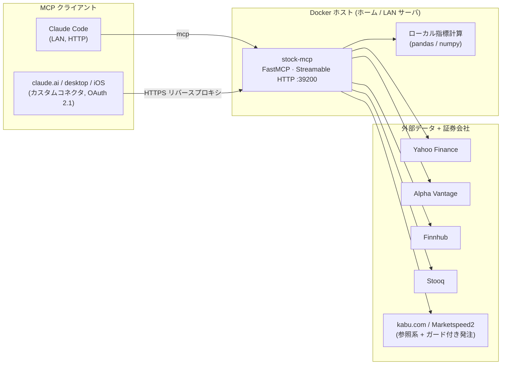

# stock-mcp

[](LICENSE)
[](pyproject.toml)
[](https://github.com/kitepon-rgb/stock-mcp/releases)

[English](README.md) · **日本語**

> **Claude にリアルタイムの株価データと数値ベースのテクニカル分析を渡す — チャート画像を読み違えるのではなく、実数で推論させるために。**
> `stock-mcp` はセルフホスト型の [Model Context Protocol](https://modelcontextprotocol.io) サーバで、マーケットデータ・ローカル計算のテクニカル指標・任意の証券発注をツールとして公開します。

公開するのは、マーケットデータ（Yahoo Finance, Alpha Vantage, Finnhub, Stooq）、
ローカルで計算するテクニカル指標（RSI, MACD, ボリンジャーバンド, ATR,
支持線/抵抗線, フィボナッチ, ポジションサイジング）、そして日本の証券会社
（kabu.com, 楽天証券 Marketspeed2）向けの参照系・発注系ツールです。すべての
ヒストリカルレコードには `interval` と `period` が付与されるため、Claude が
時間軸を読み違えることがありません — これが本プロジェクトの中核的な設計動機です。

ホーム/LAN サーバ上の Docker コンテナとして動作し、Streamable HTTP トランスポートで
Claude Code に接続します。claude.ai のカスタムコネクタとして使うための
OAuth 2.1 にも対応しています。



## クイックスタート

```bash
git clone https://github.com/kitepon-rgb/stock-mcp.git
cd stock-mcp
cp .env.example .env        # 持っている API キーを記入（最初はすべて任意）
docker compose up -d --build
```

そして Claude Code に登録します（ホストは実際に動かす場所に置き換えてください）:

```bash
claude mcp add --transport http stock-mcp http://YOUR_SERVER_IP:39200/mcp
```

Claude セッションからの最初の呼び出し例:

> stock-mcp の `yahoo_quote` で NVDA の最新気配を取って、その直近ヒストリーに `calc_rsi` をかけて。

Yahoo Finance 系ツールは API キー不要で動きます。他のデータソースを有効化する
任意のキーについては [設定](#設定) を参照してください。

## ツール

スペック準拠の Tier 1 ツール（`docs/stock-mcp-spec.md` §3.1）が Claude にとっての
推奨エントリポイントです。低レベルのソースアダプタや複合ツール `analyze_ticker` も
直接アクセス用に公開されています。

| カテゴリ | ツール |
|---|---|
| コアデータ (spec T1) | `get_stock_price`, `get_stock_history`★, `get_ticker_info`, `search_ticker` |
| 指標 (spec T1) | `calc_rsi`, `calc_macd`, `calc_moving_average`, `calc_bollinger_bands`, `calc_atr`, `calc_stochastic` |
| レベル (spec T1) | `detect_support_resistance` |
| ファンダメンタルズ (spec T1) | `get_fundamentals`, `get_analyst_targets`, `get_financial_statements` |
| ニュース・イベント (spec T2) | `get_stock_news`, `get_earnings_calendar`, `get_institutional_holders`, `get_insider_transactions` |
| チャート (spec T2) | `generate_chart_image` (chart-img.com), `generate_chart_local` (mplfinance, キー不要) |
| フィボナッチ (spec T2) | `calc_fibonacci_retracement`, `calc_fibonacci_extension` |
| セクター / ETF (spec T2) | `get_sector_performance`, `get_related_tickers`, `get_etf_holdings`, `get_leveraged_etf_info` |
| オプション / 空売り (spec T3) | `get_options_chain`, `calc_option_greeks` (Black-Scholes), `get_short_interest`, `get_dividend_history` |
| 戦略 / リスク (spec T4) | `calc_scenario_analysis`, `calc_position_sizing`, `calc_risk_reward`, `calc_dow_theory_phase`, `detect_chart_patterns`, `calc_portfolio_correlation`, `calc_value_at_risk`, `simulate_trade_outcome` |
| Yahoo Finance (raw) | `yahoo_quote`, `yahoo_history`, `yahoo_info`, `yahoo_news`, `yahoo_actions`, `yahoo_financials` |
| Alpha Vantage | `av_quote`, `av_intraday`, `av_daily`, `av_indicator` |
| Finnhub | `finnhub_quote` (米国株のリアルタイム気配) |
| Stooq | `stooq_history` |
| kabu.com (参照系) | `kabu_board`, `kabu_symbol_info`, `kabu_positions`, `kabu_orders` |
| ローカル複合 | `analyze_ticker` (history + RSI / MACD / BB / SMA / EMA / ATR / ADX) |

★ `get_stock_history` はすべてのレコードに `interval` と `period` を付与するため、
Claude が時間軸を読み違えません（本サーバの設計動機）。

発注系ツール（Marketspeed2 の `ms2_place_*` / `ms2_modify_*` / `ms2_cancel_*`）は
`STOCK_MCP_ENABLE_ORDERS=true` のときだけ登録されます（既定: オフ）。

**デプロイ時の公開範囲:** MCP クライアントのコンテキストを軽く保つため、サーバは
実行時に上記ツールの一部だけを登録し、残りは `server.py` の `_DISABLED_TOOLS`
セットでスキップします。現在のデプロイ構成では約 25 ツールが公開されています
（リアルタイム気配/ヒストリー、ローカルの `calc_*` 指標、支持線/抵抗線、
`ms2_*` Marketspeed2 ツール）。公開セットを変えるには `_DISABLED_TOOLS` を編集して
再デプロイします。

## 構成

```
src/stock_mcp/
  server.py            # FastMCP エントリポイント; ツール登録
  config.py            # 環境変数ローダー
  indicators.py        # ローカルのテクニカル指標 (純 pandas/numpy)
  analysis.py          # 上位の分析 (支持線/抵抗線, フィボナッチ, チャートパターン)
  charts.py            # チャート画像: mplfinance (ローカル) + chart-img.com (リモート)
  risk.py              # Tier 4: シナリオ / サイジング / RR / VaR / ダウ理論 / オプション Greeks
  sources/
    yahoo.py           # yfinance アダプタ (気配 / ヒストリー / ニュース / ファンダ / 決算 / 保有 / オプション / 配当 / セクター)
    alpha_vantage.py   # Alpha Vantage REST アダプタ
    finnhub.py         # Finnhub REST アダプタ (米国株のリアルタイム気配)
    stooq.py           # Stooq CSV アダプタ
    kabu.py            # kabu Station REST アダプタ (参照系)
scripts/
  deploy.sh            # ソースを rsync + リモートで docker compose up
  stock-mcp.service    # 旧 systemd ユニット (Docker に置き換え済み)
docs/
  REGISTER.md          # Claude への登録方法
Dockerfile             # コンテナイメージ (python:3.12-slim)
compose.yml            # コンテナサービス: ポート 39200, data/ ボリューム
.env.example
pyproject.toml
```

## デプロイ

任意のホスト上で Docker コンテナとして動きます（`Dockerfile` + `compose.yml`）。
リモートサーバにデプロイするには、`scripts/deploy.sh` がソースを rsync して
SSH 越しに `docker compose up -d --build` を実行します:

```bash
REMOTE=youruser@YOUR_SERVER_IP bash scripts/deploy.sh
```

サーバ上の `~/stock-mcp/.env` を編集して API キー（`ALPHA_VANTAGE_API_KEY`,
`FINNHUB_API_KEY`, 必要なら `KABU_BASE_URL` / `KABU_API_PASSWORD`）を設定し、
`cd ~/stock-mcp && docker compose up -d` で反映します。

## Claude への登録

```bash
claude mcp add --transport http stock-mcp http://YOUR_SERVER_IP:39200/mcp
```

スコープの詳細と検証コマンドは `docs/REGISTER.md` を参照してください。

## 設定

| 環境変数 | 既定値 | 意味 |
|---|---|---|
| `STOCK_MCP_HOST` | `0.0.0.0` | バインドアドレス（既定で LAN から到達可） |
| `STOCK_MCP_PORT` | `39200` | TCP ポート |
| `ALPHA_VANTAGE_API_KEY` | _(未設定)_ | `av_*` ツールに必要 |
| `FINNHUB_API_KEY` | _(未設定)_ | `finnhub_quote`（米国株リアルタイム気配）に必要 |
| `CHART_IMG_API_KEY` | _(未設定)_ | `generate_chart_image` に必要（ローカル代替: `generate_chart_local`） |
| `KABU_BASE_URL` | _(未設定)_ | 例: `http://127.0.0.1:18080` |
| `KABU_API_PASSWORD` | _(未設定)_ | kabu Station API のパスワード |
| `KABU_PRODUCTION` | `false` | `true` = 本番取引ポート |

## ライセンス

MIT © 2026 kitepon-rgb. [LICENSE](LICENSE) を参照。

> **免責事項:** 本ソフトウェアは情報提供および教育目的のみであり、投資助言では
> ありません。発注系ツールは有効化すると実際の注文を発注します — 自己責任で
> ご利用ください。確定前にすべての注文を必ず確認してください。
