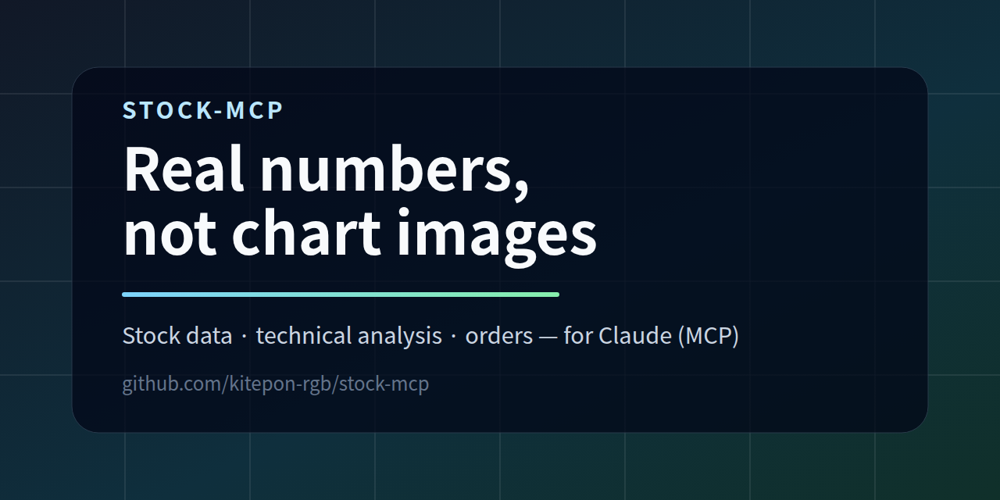
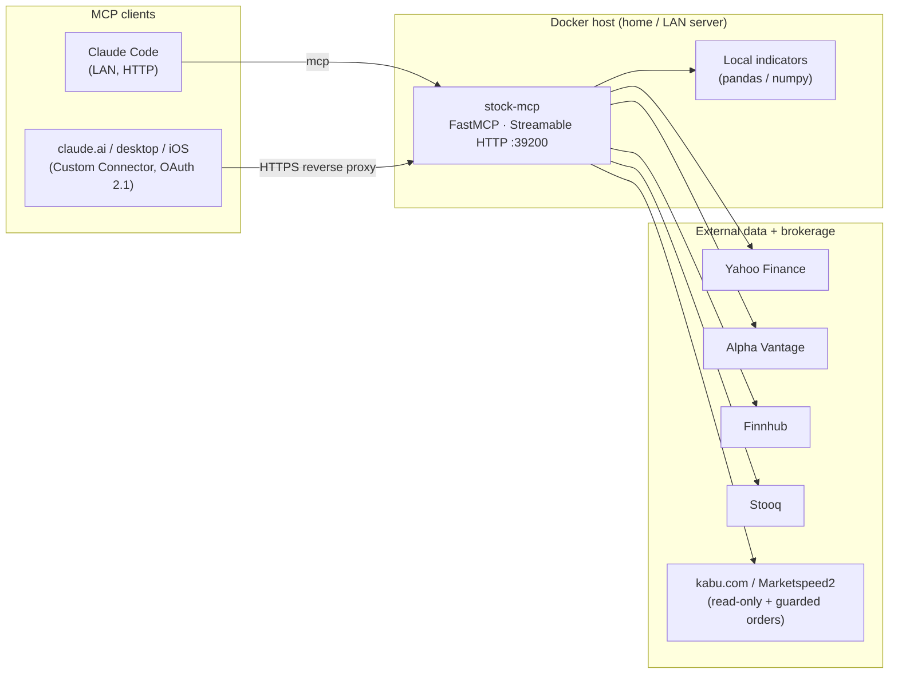

<p align="center">
  
</p>

# stock-mcp

[](LICENSE)
[](pyproject.toml)
[](https://github.com/kitepon/stock-mcp/releases)

**English** · [日本語](README.ja.md)

> **Give Claude live stock data and numeric technical analysis — so the model reasons over real numbers instead of misreading chart images.**
> `stock-mcp` is a self-hosted [Model Context Protocol](https://modelcontextprotocol.io) server that exposes market data, locally-computed indicators, and optional brokerage order execution as callable tools.

It serves market data (Yahoo Finance, Alpha Vantage, Finnhub, Stooq),
locally-computed technical indicators (RSI, MACD, Bollinger Bands, ATR,
support/resistance, Fibonacci, position sizing), and read-only or order-execution
tools for Japanese brokerages (kabu.com, Rakuten Securities Marketspeed2). Every
history record is tagged with its `interval` and `period` so Claude cannot
misread the time axis — the core design driver of the project.

It is built to run as a Docker container on a home/LAN server and connect to
Claude Code over the Streamable HTTP transport. It also supports OAuth 2.1 for
use as a Custom Connector from claude.ai.



## Quick start

```bash
git clone https://github.com/kitepon/stock-mcp.git
cd stock-mcp
cp .env.example .env        # add any API keys you have (all optional to start)
docker compose up -d --build
```

Then register it with Claude Code (replace the host with wherever you run it):

```bash
claude mcp add --transport http stock-mcp http://YOUR_SERVER_IP:39200/mcp
```

A minimal first call from a Claude session:

> Use stock-mcp's `yahoo_quote` to get the latest quote for NVDA, then `calc_rsi` on its recent history.

Yahoo Finance tools work with no API key. See [Configuration](#configuration) for
the optional keys that unlock the other data sources.

## Tools

Spec-named Tier 1 tools (`docs/stock-mcp-spec.md` §3.1) are the preferred entrypoints
for Claude. Lower-level source adapters and the composite `analyze_ticker` are also
exposed for direct access.

| Category | Tools |
|---|---|
| Core data (spec T1) | `get_stock_price`, `get_stock_history`★, `get_ticker_info`, `search_ticker` |
| Indicators (spec T1) | `calc_rsi`, `calc_macd`, `calc_moving_average`, `calc_bollinger_bands`, `calc_atr`, `calc_stochastic` |
| Levels (spec T1) | `detect_support_resistance` |
| Fundamentals (spec T1) | `get_fundamentals`, `get_analyst_targets`, `get_financial_statements` |
| News & events (spec T2) | `get_stock_news`, `get_earnings_calendar`, `get_institutional_holders`, `get_insider_transactions` |
| Charts (spec T2) | `generate_chart_image` (chart-img.com), `generate_chart_local` (mplfinance, no key) |
| Fibonacci (spec T2) | `calc_fibonacci_retracement`, `calc_fibonacci_extension` |
| Sector / ETF (spec T2) | `get_sector_performance`, `get_related_tickers`, `get_etf_holdings`, `get_leveraged_etf_info` |
| Options / shorts (spec T3) | `get_options_chain`, `calc_option_greeks` (Black-Scholes), `get_short_interest`, `get_dividend_history` |
| Strategy / risk (spec T4) | `calc_scenario_analysis`, `calc_position_sizing`, `calc_risk_reward`, `calc_dow_theory_phase`, `detect_chart_patterns`, `calc_portfolio_correlation`, `calc_value_at_risk`, `simulate_trade_outcome` |
| Yahoo Finance (raw) | `yahoo_quote`, `yahoo_history`, `yahoo_info`, `yahoo_news`, `yahoo_actions`, `yahoo_financials` |
| Alpha Vantage | `av_quote`, `av_intraday`, `av_daily`, `av_indicator` |
| Finnhub | `finnhub_quote` (real-time US stock quotes) |
| Stooq | `stooq_history` |
| kabu.com (read-only) | `kabu_board`, `kabu_symbol_info`, `kabu_positions`, `kabu_orders` |
| Local composite | `analyze_ticker` (history + RSI / MACD / BB / SMA / EMA / ATR / ADX) |

★ `get_stock_history` always tags every record with `interval` and `period`
so Claude cannot misread the time axis (the design driver of this server).

Order-execution tools (Marketspeed2 `ms2_place_*` / `ms2_modify_*` /
`ms2_cancel_*`) register only when `STOCK_MCP_ENABLE_ORDERS=true` (default: off).

**Deployed exposure:** to keep the MCP client's context lean, the server
registers only a subset of the tools above at runtime — the rest are skipped
via the `_DISABLED_TOOLS` set in `server.py`. As currently deployed ~25 tools
are exposed (real-time quote/history, the local `calc_*` indicators,
support/resistance, and the `ms2_*` Marketspeed2 tools). Edit `_DISABLED_TOOLS`
and redeploy to change the set.

## Layout

```
src/stock_mcp/
  server.py            # FastMCP entrypoint; tool registration
  config.py            # env-var loader
  indicators.py        # local technical indicators (pure pandas/numpy)
  analysis.py          # higher-level analytics (support/resistance, fibonacci, chart patterns)
  charts.py            # chart images: mplfinance (local) + chart-img.com (remote)
  risk.py              # Tier 4: scenario / sizing / RR / VaR / Dow theory / option Greeks
  sources/
    yahoo.py           # yfinance adapter (quote / history / news / fundamentals / earnings / holders / options / dividends / sector)
    alpha_vantage.py   # Alpha Vantage REST adapter
    finnhub.py         # Finnhub REST adapter (real-time US stock quotes)
    stooq.py           # Stooq CSV adapter
    kabu.py            # kabu Station REST adapter (read-only)
scripts/
  deploy.sh            # rsync source + docker compose up on remote
  stock-mcp.service    # legacy systemd unit (superseded by Docker)
docs/
  REGISTER.md          # how to register with Claude
Dockerfile             # container image (python:3.12-slim)
compose.yml            # container service: port 39200, data/ volume
.env.example
pyproject.toml
```

## Deploy

Runs as a Docker container on any host (`Dockerfile` + `compose.yml`). To deploy
to a remote server, `scripts/deploy.sh` rsyncs the source and runs
`docker compose up -d --build` over SSH:

```bash
REMOTE=youruser@YOUR_SERVER_IP bash scripts/deploy.sh
```

Edit `~/stock-mcp/.env` on the server to set API keys (`ALPHA_VANTAGE_API_KEY`,
`FINNHUB_API_KEY`, and if used `KABU_BASE_URL` / `KABU_API_PASSWORD`), then
`cd ~/stock-mcp && docker compose up -d` to apply.

## Register with Claude

```bash
claude mcp add --transport http stock-mcp http://YOUR_SERVER_IP:39200/mcp
```

See `docs/REGISTER.md` for scope details and verification commands.

## Configuration

| Env var | Default | Meaning |
|---|---|---|
| `STOCK_MCP_HOST` | `0.0.0.0` | Bind address (LAN-reachable by default) |
| `STOCK_MCP_PORT` | `39200` | TCP port |
| `ALPHA_VANTAGE_API_KEY` | _(unset)_ | Required for `av_*` tools |
| `FINNHUB_API_KEY` | _(unset)_ | Required for `finnhub_quote` (real-time US quotes) |
| `CHART_IMG_API_KEY` | _(unset)_ | Required for `generate_chart_image` (local fallback: `generate_chart_local`) |
| `KABU_BASE_URL` | _(unset)_ | e.g. `http://127.0.0.1:18080` |
| `KABU_API_PASSWORD` | _(unset)_ | kabu Station API password |
| `KABU_PRODUCTION` | `false` | `true` = live-trading port |
| `MS2_BRIDGE_URL` | _(unset)_ | Marketspeed2 bridge base URL; required for `ms2_*` tools |
| `MS2_BRIDGE_TOKEN` | _(unset)_ | Bearer token shared with the Marketspeed2 bridge |
| `STOCK_MCP_ENABLE_ORDERS` | `false` | `true` = register Marketspeed2 order preview/confirm tools |
| `STOCK_MCP_MAX_ORDER_QTY` | `1000` | Per-order quantity guard for Marketspeed2 orders |
| `STOCK_MCP_MAX_ORDER_NOTIONAL` | `5000000` | Per-order notional guard for Marketspeed2 orders |
| `STOCK_MCP_CONFIRM_TOKEN_SECRET` | _(random at startup)_ | HMAC secret for order confirm tokens |
| `STOCK_MCP_CONFIRM_TOKEN_TTL` | `60` | Confirm token TTL in seconds |

## License

MIT © 2026 kitepon. See [LICENSE](LICENSE).

> **Disclaimer:** This software is for informational and educational purposes
> only and is not financial advice. The order-execution tools place real trades
> when enabled — use them at your own risk. Verify every order before
> confirming.
